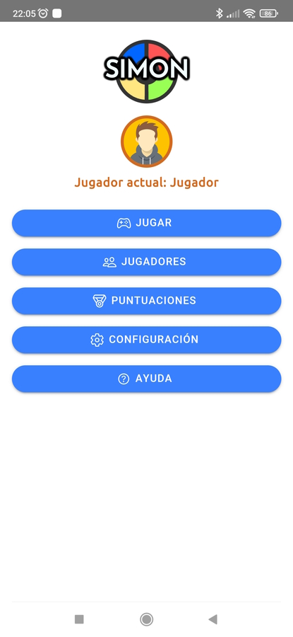
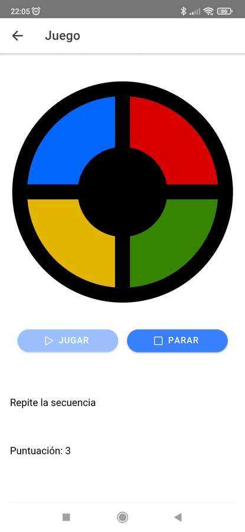
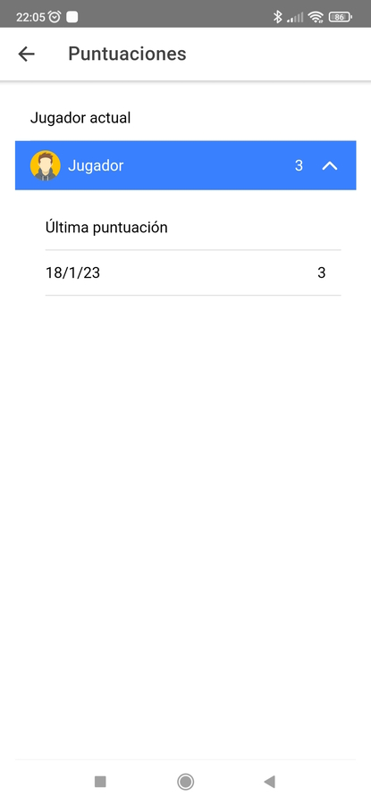

# Simón

## Descripción

Versión del juego del Simón programada con Angular en Ionic ([https://ionicframework.com](https://ionicframework.com/)).

Los datos de la aplicación se gestionan mediante NgRx ([https://ngrx.io](https://ngrx.io/)).

Documentación generada con Compodoc ([https://compodoc.app](https://compodoc.app/)).

---

## Scripts en package.json

- **start:serve**: Inicia el servidor de desarrollo de Ionic en http://localhost:8100
- **test**: Ejecuta los test unitarios
- **test:coverage**: Ejecuta los test unitarios creando un informe con la cobertura de estos sobre el código
- **compodoc:es**: Genera la documentación de la aplicación en español
- **compodoc:en**: Genera la documentación de la aplicación en inglés
- **run:external:android**: Inicia el servidor de desarrollo y lanza la aplicación en un dipositivo externo Android para desarrollo y depuración
- **build:android**: Compila la aplicación para Android
- **generate:icon:splash**: Genera los recursos para el icono de la aplicación y la pantalla de carga.

---

## Documentación

Documentación en español [aquí](https://theguitxo.github.io/ionic-simon/es/)

Documentación en inglés [aquí](https://theguitxo.github.io/ionic-simon/en/)

---

## APK

Paquete de instalación para Android:

[SIMON](./simon.apk)

---

## Capturas de pantalla

   
